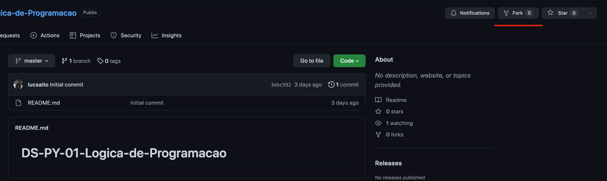

# [DS-PY-001] - Lógica de Programação (PY)
## Projeto: Hangman (Jogo da forca)

**Objetivos:**
* Trabalhar com estrutura condicional (`if`, `elif`, `else`)
* Trabalhar com estrutura de repetição (`while` e `for` loop)
* Leitura do stdin e impressão no stdout
* Utilizar manipulação(métodos) e slicing de strings
* Utilização de listas
* Utilização da biblioteca [`random`](https://docs.python.org/3/library/random.html)

**Descrição:**
Estabelecer dentro do código uma lista de palavras(ex: ```['arvore', 'banana', 'gato', 'churrasqueira']```) para uma delas ser escolhida de forma aleatória por uma função da biblioteca `random`, e estabelecer um número X de tentatitvas para o usuário tentar adivinhar se uma letra(inserida no `input()` em cada tentativa) faz parte dessa palavra escolhida aleatoriamente da lista.
Caso as tentativas do usuário acabem, imprimir uma mensagem informando que as tentativas acabaram e ele perdeu.
Caso o usuário adivinhe a palavra inteira, imprimir uma mensagem de vitória.

**Exemplo:**
Palavra escolhida "Churrasqueira", se o usuário escrever a letra "a" no `input()`, você deve mostrar da seguinte forma: ```_____A______A```. Se em seguida o usuário digitar a letra "r", teremos que imprimir:	```___RRA______RA```. E assim por diante até o usuário adivinhar a palavra, ou até as tentativas acabarem e o usuário perder.

## Instruções de envio
### 1. Fork do repositório
Agora que você tem sua própria conta no GitHub, voce poderá "bifurcar"(**fork**) este repositório. Um **fork** cria uma cópia de um repositório do GitHub em sua própria conta do GitHub. Assim, você tem pode fazer alterações no conteúdo do repositório copiado sem alterar o original.



Após clicar em `fork`, você será levado para uma nova página para a criação do repositório. Mantenha o mesmo nome do repositório a ser copiado e você terá a seguinte URL para acessar seu novo repositório:

```
https://github.com/<seu GitHub ID>/DS-PY-01-Logica-de-Programacao
```
Pronto! Agora você já pode adicionar seu código no `main.py`!

### 2. Pull request
Após finalizar seu código e adicioná-lo ao repositório de fork criado, você agora deve criar um `pull request` da seguinte maneira:
Clique no botão "New pull request" sinalizado abaixo e dê um nome para esse pull request, ex: "Projeto Hangman".

